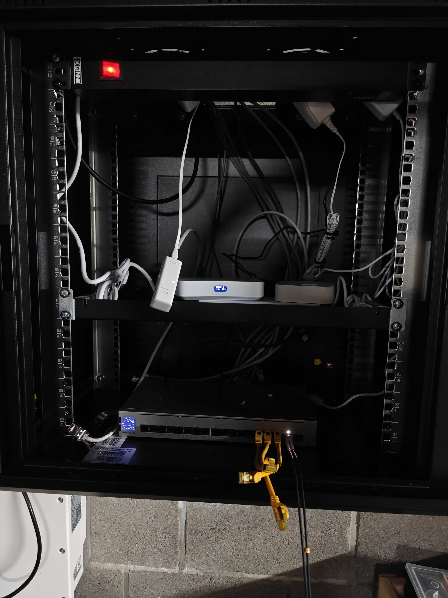
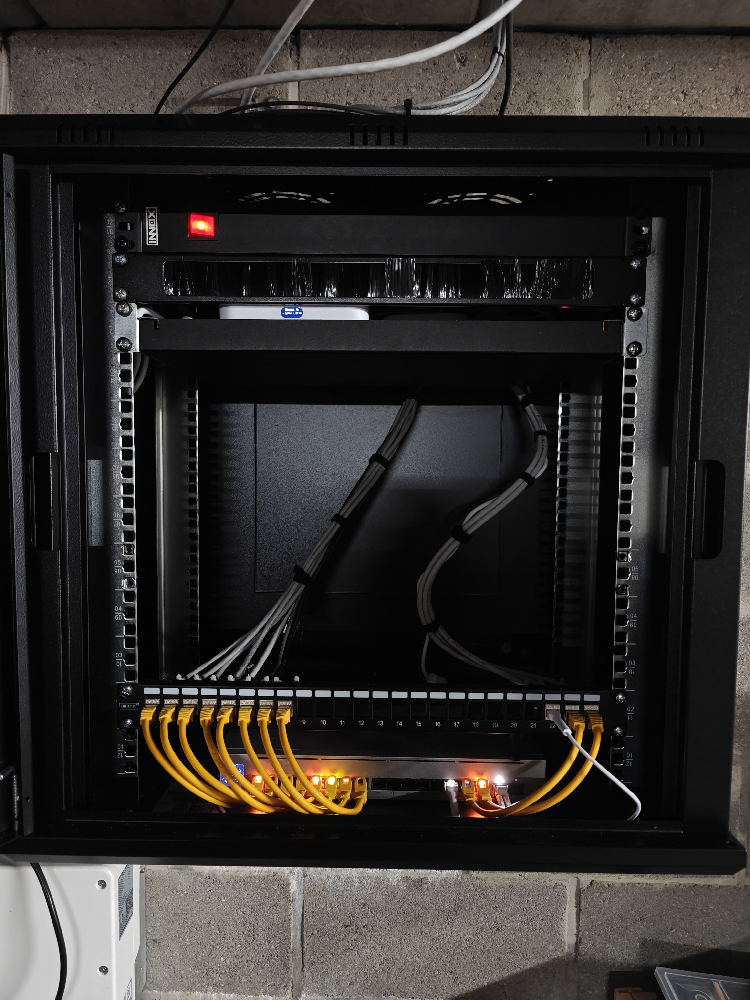
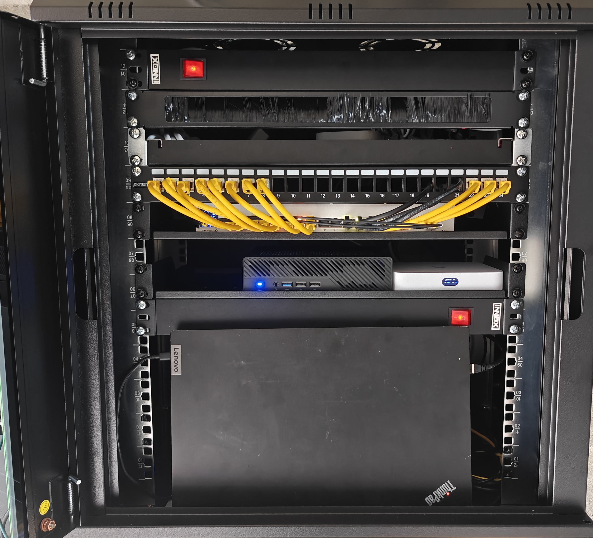

# HomeLab

Dit project omvat de evolutie van mijn thuislab. 
De plaats waar ik interesses ontdek, test en toepas. Steeds strevend naar verbetering. 

Dit alles is klein begonnen, met een synology NAS toen cloudopslag nog niet populair was. Ik was geïnteresseerd en wou hier meer over weten. Op deze NAS ontdekte ik docker en het hosten van services. Dit was voor mij de "gateway drug" naar de vorm die mijn thuislab  ondertussen gekregen heeft. 

## Architectuur

## Evolutie

