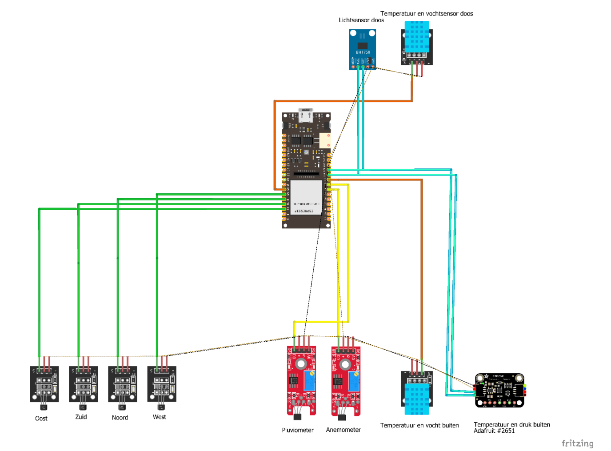
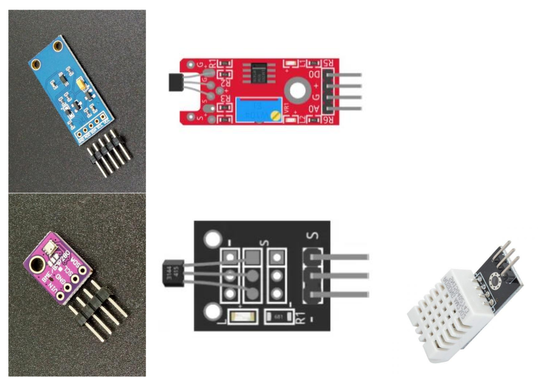
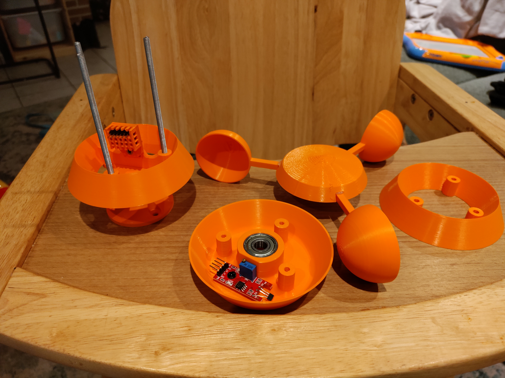
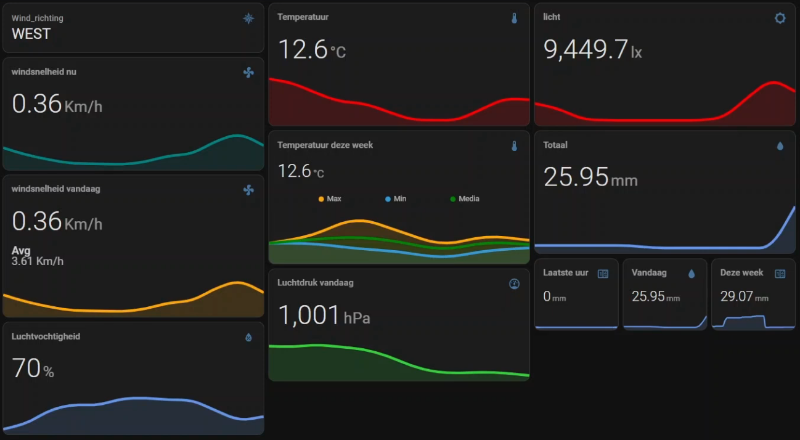
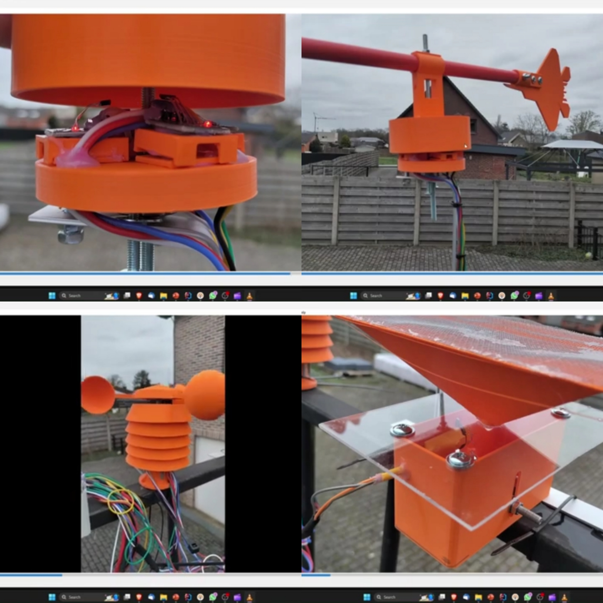

## Wat is dit project?

Voor het vak IT Essentials bouwde ik een volledig functioneel weerstation met een ESP32 als basis en Home Assistant voor visualisatie. Het doel was om binnen het kwartaal een basis weerstation op te leveren gebouwd op het ESP32 platform. Ik vond dit echter een heel interessante opdracht en besloot mij hier volledig in te investeren. 

## Link naar paper

<a href="/documents/weerstation.pdf" target="_blank">open de paper (PDF) →</a>

## Schema



## Hardware

### Microcontroller

Als basis koos ik voor de **DFRobot FireBeetle 2 (ESP32)**. Dit board heeft een geïntegreerde batterijaansluiting op de PCB, wat ideaal is gezien ik het in de toekomst graag autonoom wil laten draaien met een batterij en zonnepaneel. 

### Sensoren

Het weerstation bevat een combinatie van digitale en magnetische sensoren:

- **BMP-280** - temperatuur en luchtdruk (I²C)
- **2× DHT-22** - luchtvochtigheid (één buiten, één in de afdichtingsdoos)
- **BH1750 (GY-30)** - omgevingslicht (I²C)
- **6× Hall-sensoren (KY-003 & KY-024)** - voor anemometer, pluviometer en windrichting



### Behuizing

Alle mechanische onderdelen printte ik zelf. Voor de prototypes gebruikte ik PLA, maar de definitieve versie wordt geprint in PETG of ABS voor betere weersbestendigheid en UV-resistentie. De centrale elektronica zit in een transparante IP65 afdichtingsdoos.

## Mechanisch ontwerp

### Anemometer (windsnelheidsmeter)

De anemometer meet de windsnelheid via een magneet op een draaiende as. Bij elke volledige rotatie van 360° passeert de magneet een Hall-sensor. Door de omtrek van de rotatie (`2 × π × r`) te vermenigvuldigen met het aantal pulsen per tijdseenheid wordt de windsnelheid in km/h berekend.

### Stevenson screen

Onder de anemometer bevindt zich een Stevenson screen. Een herkenbare structuur bij weerstations die sensoren beschermt tegen direct zonlicht maar wel luchtcirculatie toelaat. Hierin zitten de BMP-280 (temperatuur en luchtdruk) en een DHT-22 (luchtvochtigheid).

### Pluviometer (regenmeter)

De pluviometer werkt op basis van een wipmechanisme: één kant van de wip vult zich met regenwater, en zodra een bepaalde hoeveelheid is bereikt, kantelt de wip. Bij elke kanteling passeert een magneet een Hall-sensor. De pulse_counter in ESPHome telt deze events en vermenigvuldigt met een kalibratiefactor om de regenval in millimeter te berekenen.

### Windrichtingmeter

De windrichtingmeter gebruikt vier Hall-sensoren (noord, oost, zuid, west) en een roterend bovenstuk gemonteerd op een kogellager. Onder de pijl zit een magneet die afhankelijk van de richting één of twee sensoren tegelijk activeert. Met een Jinja2-template in Home Assistant wordt dit vertaald naar acht windrichtingen (N, NO, O, ZO, Z, ZW, W, NW).




## Integratie framework: ESPHome

Als integratieframework koos ik **ESPHome** Dit werkt out-of-the-box met Home Assistant. 

Een fragment van de configuratie:

```yaml
sensor:
  - platform: bmp280
    temperature:
      name: "Outside Temperature"
      oversampling: 16x
    pressure:
      name: "Outside Pressure"
    address: 0x76
    update_interval: 10s

  - platform: pulse_counter
    pin: 35
    count_mode:
      rising_edge: INCREMENT
      falling_edge: INCREMENT
    unit_of_measurement: 'mm'
    name: 'PluvioMeter'
    filters:
      - multiply: 0.173
    update_interval: 10s

  - platform: pulse_counter
    pin: 34
    unit_of_measurement: 'Km/h'
    name: 'Windsnelheid'
    filters:
      - multiply: 0.18
    update_interval: 30s
```


### Windrichting via template

In Home Assistant zelf gebruik ik een template-sensor om de vier digitale inputs te combineren tot acht windrichtingen:

```yaml
- platform: template
  sensors:
    windrichting:
      friendly_name: Wind_richting
      value_template: >-
        
          NOORD-WEST
        
          NOORD-OOST
        
          NOORD
        {# ... overige richtingen ... #}
        
```

## Visualisatie in Home Assistant

In Home Assistant bouwde ik een dashboard met meerdere views: **Meteo** (overzicht), **Temperatuur**, **Luchtvochtigheid**, **Wind**, **Regenval** en **Licht**. Voor de grafieken gebruik ik `mini-graph-card`.

Per categorie zijn er meerdere kaarten met verschillende tijdsvensters. Zo zie je bijvoorbeeld voor regen tegelijk de waarde van het laatste uur, vandaag, deze week, deze maand en dit jaar.



## Wat ik geleerd heb

Dit project heeft mij op veel vlakken dingen bijgeleerd. Van het werken met het ESP32-platform, tot het integreren van sensoren, tekenen van schema's met Fritzing en het visualiseren van de data die ze opleveren. Daarnaast heeft het mij ook mechanische inzichten gegeven bij het bouwen van het weerstation.

Ik vond dit een heel leerrijke ervaring!

## Demo

[Demo op YouTube ->](https://www.youtube.com/watch?v=rKgtdgKVfDY)

